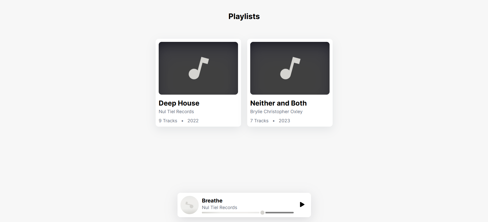

# Linear Media Player

<!-- project screenshots -->




## &nbsp;

&nbsp;

### Getting started

Clone the repo and run:

```bash
npm install
npm run dev
```

### Attribution

This project includes music from the following albums:

- **"Deep House"** by _Nul Tiel Records_ is licensed under [CC BY-NC-SA 4.0](https://creativecommons.org/licenses/by-nc-sa/4.0/).
- **"Neither and Both"** by _Brylie Christopher Oxley_ is licensed under [CC BY 4.0](https://creativecommons.org/licenses/by/4.0/).
